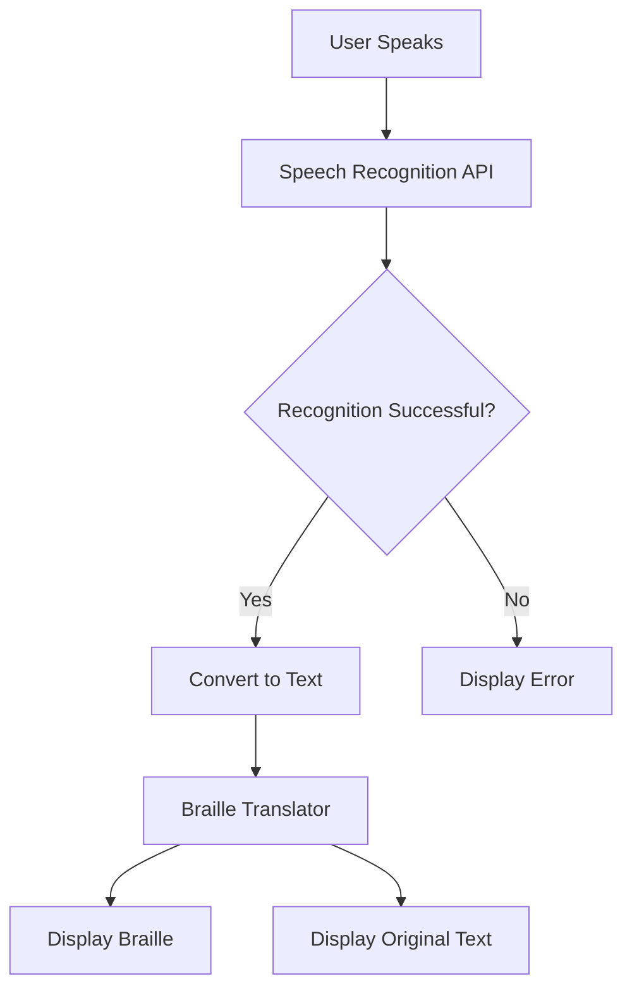
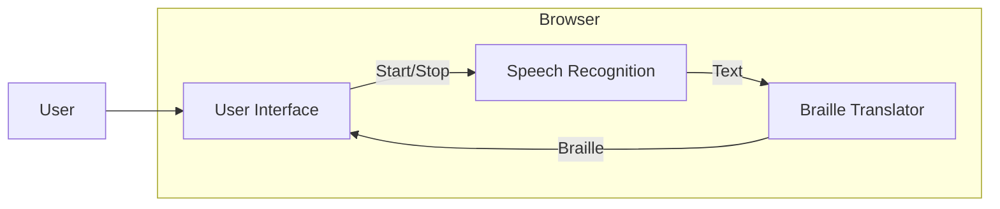
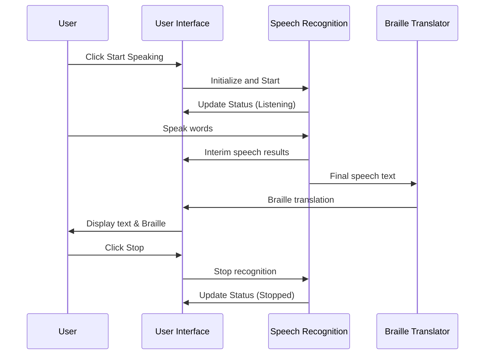

# Speech to Braille Converter

A web application that converts spoken language to Braille in real-time using speech recognition technology.

## Features

- Real-time speech to text conversion
- Instant translation of text to Braille
- Simple, accessible user interface
- Error handling and status indicators
- Works in modern browsers supporting Speech Recognition API

## Technologies Used

- HTML5
- CSS3
- JavaScript (ES6+)
- Web Speech API
- Custom Braille translation algorithm

## File Structure

```
speech-to-braille/
├── index.html          # Main application interface
├── app.js              # Speech recognition and application logic
├── braille-translator.js # Text to Braille translation functionality
├── styles.css          # Application styling
└── README.md           # Project documentation
```

## How It Works

1. The application uses the Web Speech API to capture spoken words
2. The captured speech is converted to text in real-time
3. The text is then passed through the Braille translator algorithm
4. Both the original text and Braille translation are displayed to the user simultaneously

### Application Flow



### Component Architecture



### Interaction Sequence



## Setup Instructions

1. Clone this repository
2. Open index.html in a compatible web browser (Chrome, Edge, Safari recommended)
3. No server setup or additional dependencies are required

## Usage

1. Click "Start Speaking" to begin speech recognition
2. Speak clearly into your microphone
3. Watch as your speech appears as text and is converted to Braille
4. Click "Stop" to pause recognition
5. Click "Reset" to clear the outputs

## Browser Compatibility

The application works best in browsers that support the Web Speech API:
- Google Chrome (recommended)
- Microsoft Edge
- Safari (partial support)
- Firefox (may require enabling flags)

## Limitations

- Requires microphone access
- Depends on browser's speech recognition capabilities
- Internet connection may be required for some browsers' speech recognition
- Braille output is limited to characters supported in the translation algorithm

## Future Improvements

- Support for multiple languages
- Tactile feedback options
- Downloadable Braille output
- Customizable translation settings
