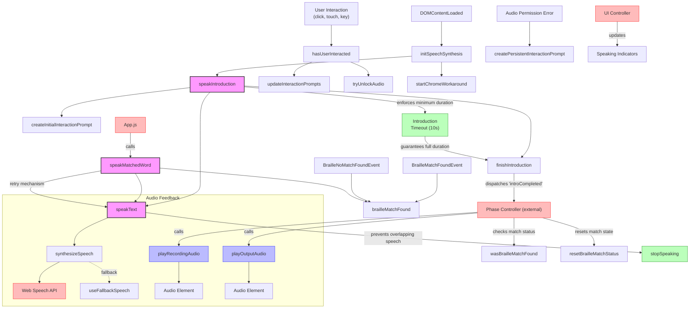

# Text-to-Speech Module Documentation

This document provides a complete reference for the Text-to-Speech functionality in the Speech-to-Braille application.

## Overview

The Text-to-Speech module is responsible for providing audio feedback to users through speech synthesis. It handles introductions, reading matched braille words, and providing audio cues during phase transitions.

## Functions Reference

### Core Speech Functions
- `speakText(text, callback)`: Speaks the provided text and executes the callback when complete
- `stopSpeaking()`: Immediately stops any ongoing speech
- `speakMatchedWord(word)`: Specialized function to speak matched braille words
- `speakIntroduction()`: Speaks the welcome introduction message
- `speakWelcome()`: Legacy wrapper for speakIntroduction (deprecated)

### Speech Engine Management
- `initSpeechSynthesis()`: Sets up speech synthesis and selects appropriate voice
- `synthesizeSpeech(utterance)`: Wrapper for the Web Speech API with error handling
- `useFallbackSpeech(text, callback)`: Visual fallback when audio speech is unavailable
- `startChromeWorkaround()`: Fixes Chrome's speech synthesis timeout issue

### Audio Transition Effects
- `playRecordingAudio()`: Plays the audio cue for entering recording mode
- `playOutputAudio()`: Plays the audio cue for entering output mode
- `tryUnlockAudio()`: Attempts to unlock audio capabilities in mobile browsers

### User Interaction Management
- `updateInteractionPrompts()`: Updates UI prompts based on interaction state
- `createInitialInteractionPrompt()`: Creates the initial audio permission prompt
- `createPersistentInteractionPrompt()`: Creates a more prominent interaction prompt when needed
- `finishIntroduction(speakingIndicator)`: Completes the introduction phase and transitions to recording

### State Management
- `wasBrailleMatchFound()`: Returns whether a braille match was found
- `resetBrailleMatchStatus()`: Resets the braille match status flag

## Event Listeners

The module sets up several event listeners:
- DOM Content Loaded: Initializes speech synthesis and registers other event listeners
- User Interaction Events (click, touchstart, keypress): Detects user interactions for audio unlocking
- Custom Events:
  - `brailleMatchFound`: Updates match state when braille matches are found
  - `brailleNoMatchFound`: Updates match state when no matches are found

## Module Flow Diagram



## Integration with Other Modules

The Text-to-Speech module integrates with several other components:
    
1. **Phase Controller**: Receives phase transition events and provides audio feedback
2. **App Module**: Used to process speech for braille matching and announcement
3. **UI Controller**: Updates UI elements based on speech states
4. **BLE Controller**: Coordinates with hardware during speech phases

## Public API

The module exposes the following public interface through `window.textToSpeech`:
```javascript
window.textToSpeech = {
    speak: speakText,
    stop: stopSpeaking,
    speakMatchedWord,
    speakIntroduction,
    speakWelcome,
    playRecordingAudio,
    playOutputAudio,
    wasBrailleMatchFound,
    resetBrailleMatchStatus,
    introCompleted: () => introCompleted
};
```

## Configuration Options

The module respects several configuration options from the global config:
- `config.timings.introductionPhase`: Duration of the introduction phase
- `config.behavior.debugMode`: Enables additional logging
- `config.behavior.loopListeningIfNoMatch`: Used in conjunction with braille match detection

## Troubleshooting

Common issues:

1. **Audio not playing**: This is usually due to browsers requiring user interaction before allowing audio playback. The module attempts to handle this with interaction prompts.

2. **Speech synthesis not working**: The module includes fallbacks for when speech synthesis fails, including visual indicators.

3. **Chrome speech timeout**: A known issue in Chrome where speech synthesis stops after a period of inactivity - fixed with the Chrome workaround.

## Technical Notes

### Phase Timing Control

The Text-to-Speech module interacts closely with the Phase Controller to manage application flow:

1. **Introduction Phase Timing**:
   - The introduction phase has a fixed duration (default 10 seconds)
   - Early speech synthesis completion does not automatically end the phase
   - The module enforces minimum phase duration through `window.hasMovedPastIntro` flag
   - Only after the full duration will `finishIntroduction()` transition to the recording phase

2. **Speech Coordination**:
   - A speech lock (`isSpeaking` flag) prevents overlapping utterances
   - When a match is found in the recording phase, it's properly carried to the output phase
   - The output phase prioritizes speaking the matched braille word

### Common Pitfalls

1. **Introduction Too Short**: If the introduction phase appears to end too quickly, check:
   - The `speakIntroduction()` function should have a minimum wait of 10 seconds
   - The `finishIntroduction()` function should enforce `window.hasMovedPastIntro`
   - The timeout should only trigger if not already transitioned

2. **Output Phase Speech Issues**: If speech doesn't work during output phase:
   - Ensure speech synthesis lock (`isSpeaking`) properly manages the queue
   - Add proper delay between speech attempts (minimum 300ms)
   - Verify that match status flag (`brailleMatchFound`) is carried between phases

### Debugging

The module includes several debugging tools:
- Adding `console.time/timeEnd` around critical sections can identify timing issues
- Chrome Dev Tools can monitor the speech queue with `window.speechSynthesis.speaking`
- `config.behavior.debugMode`: Enables additional logging
